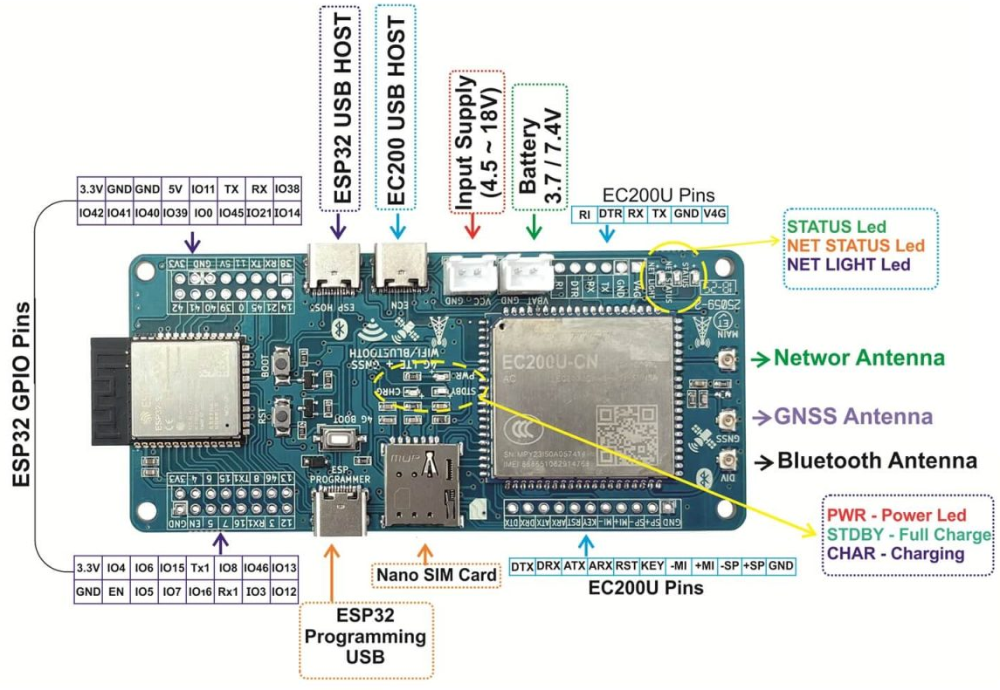

# QuectelEC200U Module


Arduino library for Quectel EC200U (CN-AA firmware) providing a robust AT-command wrapper and advanced examples for easier integration of cellular connectivity into your projects.

Repository: [https://github.com/MISTERNEGATIVE21/QuectelEC200U](https://github.com/MISTERNEGATIVE21/QuectelEC200U)

## Where to Buy

- **Sharvi Electronics ESP32-S3 with EC200U**: [Buy Here](https://sharvielectronics.com/product/esp32-s3-with-ec200u-4g-lte-cat-1-wifi-bluetooth-gnss-iot-smart-modem/)



More information on Custom ESP32-S3 with EC200U: [Sharvi Electronics ESP32-S3 with EC200U](https://github.com/SharviElectronics/ESP32-S3-with-EC200U/tree/main)

- **Capuf EC200U-CN Module**: [Buy Here](https://capuf.in/products/ec200u-cn-4g-lte-modem)


More information on Capuf Module: [Capuf Module](https://capuf.in/products/ec200u-cn-4g-lte-modem)

## Features
- **Core & State Management:** Initialization, AT command interface, state tracking.
- **Network:** SIM/registration, PDP attach/activation, signal strength, operator info.
- **TCP/IP:** TCP sockets (QIOPEN/QISEND/QIRD).
- **SSL/TLS:** Secure sockets (QSSLCFG/QSSLOPEN), CA certificate management.
- **HTTP/HTTPS:** GET and POST requests.
- **MQTT:** Connect, publish, subscribe, disconnect (with TLS support).
- **SMS:** Send, read, delete, and count SMS messages.
- **Voice Calls:** Dial, answer, hang up, list calls, and manage caller ID.
- **USSD:** Send and receive USSD messages.
- **GNSS:** Start/stop, get location (NMEA or parsed), and configure GNSS.
- **NTP & Time:** Synchronize time with an NTP server, get/set the module's clock.
- **Filesystem:** List, upload, read, and delete files on the module's filesystem.
- **TTS (Text-to-Speech):** Play text as speech.
- **FTP:** Login, download files, and logout.
- **Audio:** Control speaker volume, microphone gain, sidetone, and audio routing.
- **Power Management:** Power save mode (PSM), power off, and reboot.
- **Debugging:** Debug output stream for easier troubleshooting.

## Installation
1.  Download the latest release from the [GitHub repository](https://github.com/MISTERNEGATIVE21/QuectelEC200U/releases).
2.  In the Arduino IDE, go to `Sketch > Include Library > Add .ZIP Library...` and select the downloaded file.
3.  The library will be available in `Sketch > Include Library > QuectelEC200U`.

## Getting Started

Here is a simple example of how to initialize the modem, connect to the network, and make an HTTP GET request.

```cpp
#include <QuectelEC200U.h>

// Define pins for your board
#define EC200U_RX_PIN 16
#define EC200U_TX_PIN 17

#if defined(ARDUINO_ARCH_ESP32)
  HardwareSerial SerialAT(1);
  QuectelEC200U modem(SerialAT, 115200, EC200U_RX_PIN, EC200U_TX_PIN);
#elif defined(ARDUINO_ARCH_ZEPHYR)
  HardwareSerial& SerialAT = Serial1;
  QuectelEC200U modem(SerialAT, 115200, EC200U_RX_PIN, EC200U_TX_PIN);
#else
  #include <SoftwareSerial.h>
  SoftwareSerial SerialAT(7, 8); // RX, TX
  QuectelEC200U modem(SerialAT);
#endif

void setup() {
  Serial.begin(115200);
  
  #if defined(ARDUINO_ARCH_ZEPHYR)
    SerialAT.begin(115200);
  #elif !defined(ARDUINO_ARCH_ESP32)
    SerialAT.begin(9600); // SoftwareSerial default
  #endif

  Serial.println("Initializing modem...");
  if (modem.begin()) {
    Serial.println("Modem initialized.");
  } else {
    Serial.print("Failed to initialize modem. Error: ");
    Serial.println(modem.getLastErrorString());
    while (1);
  }

  Serial.println("Waiting for network...");
  if (modem.waitForNetwork()) {
    Serial.println("Network connected.");
  } else {
    Serial.print("Failed to connect to network. Error: ");
    Serial.println(modem.getLastErrorString());
    while (1);
  }

  Serial.println("Attaching to data network...");
  modem.attachData("your.apn"); // Replace with your APN

  String response;
  Serial.println("Performing HTTP GET...");
  if (modem.httpGet("http://example.com", response)) {
    Serial.println("Response:");
    Serial.println(response);
  } else {
    Serial.print("HTTP GET failed. Error: ");
    Serial.println(modem.getLastErrorString());
  }
}

void loop() {
  // Your code here
}
```

## Default Pin Definitions

Most ESP32 examples share the same wiring so you can copy/paste between sketches:

| Signal | ESP32 Pin | Description |
| --- | --- | --- |
| `EC200U_RX_PIN` | 16 | Connects to the modem TX (ESP32 receives data) |
| `EC200U_TX_PIN` | 17 | Connects to the modem RX (ESP32 transmits data) |
| `EC200U_PWRKEY_PIN` | 10 | Drive LOW for ~2 s to toggle modem power |
| `EC200U_STATUS_PIN` | 2 | Optional status feedback (HIGH when modem is on) |

Update the macros at the top of each sketch if your carrier board routes the modem elsewhere. Non‑ESP32 boards still use the same macro names so the documentation stays consistent.

## Indian APN Settings

For users in India, you may need to set the APN (Access Point Name) for your mobile carrier. Here is a list of common APNs:

- **Jio:** `jionet`
- **Airtel:** `airtelgprs.com`
- **Vodafone Idea (Vi):** `www`
- **BSNL:** `bsnlnet`

You can use the `getOperator()` function to identify the network and then set the APN accordingly. For a detailed example, see `examples/Indian_APN_Demo/Indian_APN_Demo.ino`.

## PPPoS (Point-to-Point Protocol over Serial)

This library can be used with the `PPPOSClient` library to establish a PPP connection with the EC200U modem. This allows you to use standard networking libraries like `WiFiClient` and `HTTPClient` over the cellular connection.

For a detailed example, see `examples/PPPOS_Demo/PPPOS_Demo.ino`.

  ### TCP Socket Example

  For raw sockets (e.g. pushing bytes to a custom server), the pattern is the same: bring up data, open a socket with `tcpOpen`, send with `tcpSend`, and read with `tcpRecv`. The new `examples/TCP_Client_Quickstart/TCP_Client_Quickstart.ino` sketch contains a full walk-through; the core loop looks like this:

  ```cpp
  const char HOST[] = "postman-echo.com";
  int socketId = modem.tcpOpen(HOST, 80, 1, 0);
  if (socketId >= 0) {
    modem.tcpSend(socketId, "GET /get HTTP/1.1\r\nHost: postman-echo.com\r\n\r\n");
    String response;
    if (modem.tcpRecv(socketId, response, 1024, 8000)) {
      Serial.println(response);
    }
    modem.tcpClose(socketId);
  }
  ```

  ### HTTPS Example

  To talk to HTTPS endpoints you must provision a CA certificate once, configure an SSL context, and then call `httpsGet`/`httpsPost`. See `examples/HTTPS_Client_Quickstart/HTTPS_Client_Quickstart.ino` for a ready-to-run sketch. The critical steps are:

  ```cpp
  modem.sslUploadCert(cloudflare_ca_cert, "cloudflare.pem");
  modem.sslConfigure(1, "cloudflare.pem");

  String response;
  if (modem.httpsGet("https://www.cloudflare.com/", response)) {
    Serial.println(response);
  } else {
    Serial.println(modem.getLastErrorString());
  }
  ```

  ### Experimental Examples

  Under the `examples/experimental/` folder, you will find more complex demos that rely on third-party integrations or external libraries:

  #### 1. Consentium IoT Telemetry (`Consentium_IoT_Demo`)
  Uploads JSON telemetry data over a secure socket. It loads the Consentium IoT TLS cert, configures SSL (`sslConfigure`), and posts metrics to `https://api.consentiumiot.com`. It can optionally set a `receiveKey` to fetch recent updates immediately after sending.

  #### 2. Telegram Bot (`Telegram_Bot_Demo`)
  Demonstrates using the new `QuectelTelegramBot` helper class to natively interact with the Telegram API. Instead of relying on unwieldy external Wi-Fi libraries or PPPoS, this lightweight class hooks directly into the modem's built-in `httpsGet` and `httpsPost` commands. It easily processes incoming JSON updates and handles sending messages effortlessly.


  ### WebUI Hotspot API

  The WebUI Hotspot example has grown into a full control panel with REST endpoints you can also script against:

  | Endpoint | Purpose |
  | --- | --- |
  | `GET /api/status` | Adds RSRP/RAT details, APN origin, and MQTT summary fields. |
  | `GET /api/device/sensors` | Battery status (`+CBC` percent/voltage) plus on-board ADC sample. |
  | `GET/POST /api/pdp/*` | Inspect PDP selection, activate/deactivate a context, or clear a saved APN. |
  | `GET/POST /api/mqtt/*` | Track broker state, connect with APN overrides, publish payloads, and subscribe to topics. |
  | `GET /api/call/status`, `POST /api/call/answer`, `POST /api/call/volume` | Surface active calls, answer incoming rings, and bump speaker volume from the UI.

  The corresponding frontend now shows a Power & Sensors card, PDP controls, MQTT client section, and a richer Phone tab (answer button, live log, and speaker volume slider). These APIs are ideal for integrating the modem with external dashboards without touching the AT layer.


## API Reference

### Core
- `begin(bool forceReinit = false)`: Initializes the modem.
- `sendAT(const String &cmd, const String &expect = "OK", uint32_t timeout = 3000)`: Sends an AT command.
- `readResponse(char* buffer, size_t length, uint32_t timeout)`: Reads the response from the modem into the provided buffer.
- `getIMEI()`: Gets the modem's IMEI.
- `getModemInfo()`: Gets information about the modem.
- `factoryReset()`: Resets the modem to factory defaults.
- `powerOff()`: Powers off the modem.
- `reboot()`: Reboots the modem.

### Error Handling
- `getLastError()`: Returns the last error code as an `ErrorCode` enum.
- `getLastErrorString()`: Returns a string description of the last error.

### State Management
- `getState()`: Returns the current modem state (`ModemState` enum).
- `isInitialized()`: Returns `true` if the modem is initialized.
- `isNetworkReady()`: Returns `true` if the modem is registered on the network.
- `setState(ModemState state)`: Sets the modem state.

### Debugging
- `enableDebug(Stream &debugStream)`: Enables debug output to the specified stream.

### Network
- `waitForNetwork(uint32_t timeoutMs = 60000)`: Waits for the modem to register on the network.
- `attachData(const String &apn, const String &user = "", const String &pass = "", int auth = 0)`: Attaches to the data network.
- `activatePDP(int ctxId = 1)`: Activates the Packet Data Protocol context.
- `deactivatePDP(int ctxId = 1)`: Deactivates the PDP context.
- `getRegistrationStatus(bool eps = true)`: Gets the network registration status.
- `isSimReady()`: Returns `true` if the SIM card is ready.
- `getOperator()`: Gets the name of the network operator.
- `getSignalStrength()`: Gets the signal strength (RSSI).
- `setAPN(const String &apn)`: Sets the Access Point Name (APN).

### HTTP/HTTPS
- `httpGet(const String &url, String &response)`: Performs an HTTP GET request.
- `httpPost(const String &url, const String &data, String &response)`: Performs an HTTP POST request.
- `httpsGet(const String &url, String &response)`: Performs an HTTPS GET request. **Note:** You must call `sslConfigure()` before using this function.
- `httpsPost(const String &url, const String &data, String &response)`: Performs an HTTPS POST request. **Note:** You must call `sslConfigure()` before using this function.

### MQTT
- `mqttConnect(const String &server, int port)`: Connects to an MQTT broker.
- `mqttPublish(const String &topic, const String &message)`: Publishes a message to an MQTT topic.
- `mqttSubscribe(const String &topic)`: Subscribes to an MQTT topic.
- `mqttDisconnect()`: Disconnects from the MQTT broker.

### TCP Sockets
- `tcpOpen(const String &host, int port, int ctxId = 1, int socketId = 0)`: Opens a TCP socket.
- `tcpSend(int socketId, const String &data)`: Sends data over a TCP socket.
- `tcpRecv(int socketId, String &out, size_t bytes = 512, uint32_t timeout = 5000)`: Receives data from a TCP socket.
- `tcpClose(int socketId)`: Closes a TCP socket.

### USSD
- `sendUSSD(const String &code, String &response)`: Sends a USSD code.

### NTP & Time
- `ntpSync(const String &server = "pool.ntp.org", int timezone = 0)`: Synchronizes the time with an NTP server.
- `getClock()`: Gets the current time from the modem.
- `setClock(const String &datetime)`: Sets the time on the modem.

### GNSS
- `startGNSS()`: Starts the GNSS receiver.
- `stopGNSS()`: Stops the GNSS receiver.
- `isGNSSOn()`: Returns `true` if the GNSS receiver is on.
- `setGNSSConfig(const String &item, const String &value)`: Configures a GNSS parameter.
- `getNMEASentence(const String &type = "RMC")`: Gets a raw NMEA sentence.
- `getGNSSLocation()`: Gets the parsed GNSS location.
- `getGNSSLocation(uint32_t fixWaitMs)`: Gets the parsed GNSS location, waiting for a fix.

### Text-to-Speech (TTS)
- `playTTS(const String &text)`: Plays the given text as speech.

### FTP
- `ftpLogin(const String &server, const String &user, const String &pass)`: Logs in to an FTP server.
- `ftpDownload(const String &filename, String &data)`: Downloads a file from the FTP server.
- `ftpLogout()`: Logs out from the FTP server.

### Filesystem
- `fsList(String &out)`: Lists the files on the modem's filesystem.
- `fsUpload(const String &path, const String &content)`: Uploads content to a file.
- `fsRead(const String &path, String &out, size_t length = 0)`: Reads a file.
- `fsDelete(const String &path)`: Deletes a file.
- `fsExists(const String &path)`: Checks if a file exists.

### SSL/TLS
- `sslConfigure(int ctxId, const String &caPath, bool verify = true)`: Configures SSL/TLS for a context.

### Power Management
- `enablePSM(bool enable)`: Enables or disables Power Save Mode (PSM).

### Audio
- `setSpeakerVolume(int level)`: Sets the speaker volume.
- `setRingerVolume(int level)`: Sets the ringer volume.
- `setMicMute(bool mute)`: Mutes or unmutes the microphone.
- `setMicGain(int channel, int level)`: Sets the microphone gain.
- `setSidetone(bool enable, int level)`: Enables or disables sidetone.
- `setAudioChannel(int channel)`: Sets the audio channel.
- `setAudioInterface(const String &params)`: Configures the audio interface.
- `audioLoopback(bool enable)`: Enables or disables audio loopback.

## Constructors

The library provides two constructors to accommodate different hardware setups:

### HardwareSerial
For boards like ESP32, you can use a `HardwareSerial` port. You can also specify the RX and TX pins.

```cpp
#include <QuectelEC200U.h>

HardwareSerial& SerialAT = Serial1;
QuectelEC200U modem(SerialAT, 115200, /* RX */ 16, /* TX */ 17);
```

### Stream
For other boards or configurations (e.g., `SoftwareSerial`), you can use any `Stream` object.

```cpp
#include <SoftwareSerial.h>
#include <QuectelEC200U.h>

SoftwareSerial SerialAT(7, 8); // RX, TX
QuectelEC200U modem(SerialAT);
```

## State Management

The library uses a state machine to track the modem's status. You can get the current state using `modem.getState()`. The possible states are:

- `MODEM_UNINITIALIZED`: The modem has not been initialized.
- `MODEM_INITIALIZING`: The modem is currently initializing.
- `MODEM_READY`: The modem is initialized and ready to receive commands.
- `MODEM_ERROR`: An error occurred during initialization. Use `getLastError()` or `getLastErrorString()` to get more information.
- `MODEM_NETWORK_CONNECTED`: The modem is registered on the network.
- `MODEM_DATA_READY`: The modem has an active data connection.

## Debugging

You can enable debug messages to a `Stream` object (e.g., `Serial`) to get more insight into the library's operation.

```cpp
void setup() {
  Serial.begin(115200);
  modem.enableDebug(Serial);
  // ...
}
```

## Contributing
Contributions are welcome! Please open an issue or submit a pull request on the [GitHub repository](https://github.com/MISTERNEGATIVE21/QuectelEC200U).

## Maintainer
MisterNegative21 <misternegative21@gmail.com>

## License
This library is released under the MIT License. See the [LICENSE](./LICENSE) file for details.

## Trademarks & Attribution
Quectel, EC200U, and related marks are trademarks or registered trademarks of Quectel Wireless Solutions Co., Ltd. This library is unofficial and not affiliated with Quectel.

## Changelog

### v2.7.0
- **GPS Optimization:** Added `GNSSData` struct and robust `getGNSSData` method to parse NMEA sentences directly into simple properties.
- **WebUI Hotspot Refactor:** Improved `WebUI_Hotspot.ino` to use struct-based GPS parsing, added automatic data connectivity on startup with stored APNs.
- **Example Cleanup:** Removed redundant legacy examples to reduce clutter, favoring unified examples (like `HTTP_HTTPS_Unified_Demo`).

### v2.6.0
- **New Platform Support:** Added support for **Arduino Q Uno** (Zephyr-based) using `ARDUINO_ARCH_ZEPHYR`.
- **Optimization:** Converted library to use `const char*` for string parameters, significantly reducing memory usage and overhead.
- **Compatibility:** Added `String` overloads to maintain backward compatibility and fix `F()` macro usage issues.
- **Examples:** Updated all 35+ examples to support ESP32, Zephyr, and SoftwareSerial platforms automatically.
- **Fixes:** Resolved duplicate code blocks in advanced examples.

### v2.5.0
- Initial major release with advanced features (SSL, MQTT, GNSS, etc.).
