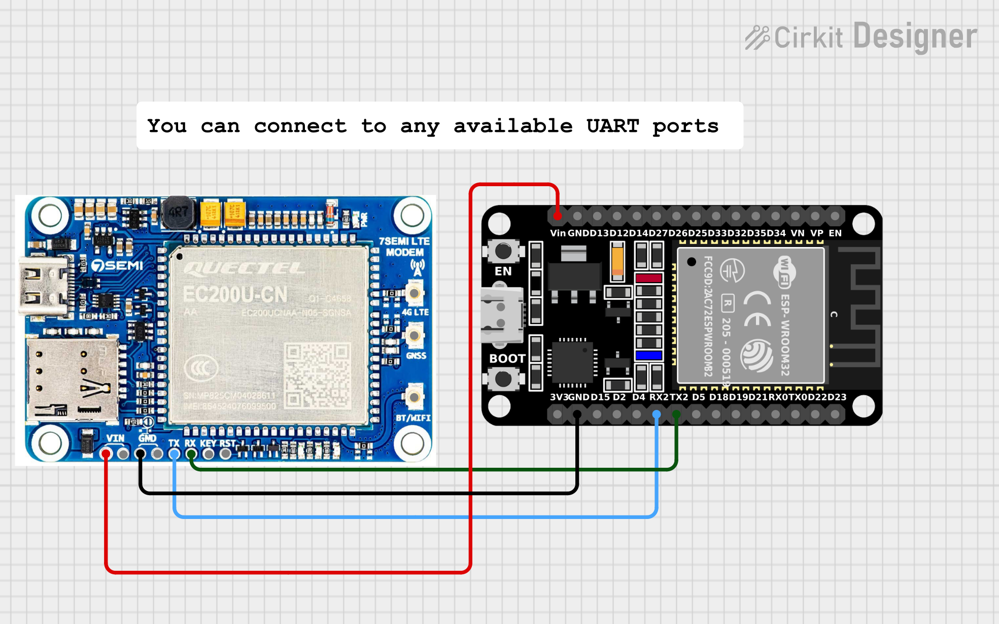

# QuectelEC200U Module



Arduino library for Quectel EC200U (CN-AA firmware) providing a robust AT-command wrapper and advanced examples for easier integration of cellular connectivity into your projects.

Repository: [https://github.com/MISTERNEGATIVE21/QuectelEC200U](https://github.com/MISTERNEGATIVE21/QuectelEC200U)

More information on Custom ESP32-S3 with EC200U: [Sharvi Electronics ESP32-S3 with EC200U](https://github.com/SharviElectronics/ESP32-S3-with-EC200U/tree/main)


More information on Capcuf EC200U-CN Module: [Capcuf EC200U-CN Module](https://www.capcuf.com/ec200ucn-module)

## Features
- **Core & State Management:** Initialization, AT command interface, state tracking.
- **Network:** SIM/registration, PDP attach/activation, signal strength, operator info.
- **TCP/IP:** TCP sockets (QIOPEN/QISEND/QIRD).
- **SSL/TLS:** Secure sockets (QSSLCFG/QSSLOPEN), CA certificate management.
- **HTTP/HTTPS:** GET and POST requests.
- **MQTT:** Connect, publish, subscribe, disconnect (with TLS support).
- **SMS:** Send, read, delete, and count SMS messages.
- **Voice Calls:** Dial, answer, hang up, list calls, and manage caller ID.
- **USSD:** Send and receive USSD messages.
- **GNSS:** Start/stop, get location (NMEA or parsed), and configure GNSS.
- **NTP & Time:** Synchronize time with an NTP server, get/set the module's clock.
- **Filesystem:** List, upload, read, and delete files on the module's filesystem.
- **TTS (Text-to-Speech):** Play text as speech.
- **FTP:** Login, download files, and logout.
- **Audio:** Control speaker volume, microphone gain, sidetone, and audio routing.
- **Power Management:** Power save mode (PSM), power off, and reboot.
- **Debugging:** Debug output stream for easier troubleshooting.

## Installation
1.  Download the latest release from the [GitHub repository](https://github.com/MISTERNEGATIVE21/QuectelEC200U/releases).
2.  In the Arduino IDE, go to `Sketch > Include Library > Add .ZIP Library...` and select the downloaded file.
3.  The library will be available in `Sketch > Include Library > QuectelEC200U`.

## Getting Started

Here is a simple example of how to initialize the modem, connect to the network, and make an HTTP GET request.

```cpp
#include <QuectelEC200U.h>

// For ESP32, you can use HardwareSerial
HardwareSerial& SerialAT = Serial1; // Use Serial1, Serial2, etc. as available

// For other boards, you might need SoftwareSerial
// #include <SoftwareSerial.h>
// SoftwareSerial SerialAT(7, 8); // RX, TX

QuectelEC200U modem(SerialAT);

void setup() {
  Serial.begin(115200);
  SerialAT.begin(115200); // Or your desired baud rate

  Serial.println("Initializing modem...");
  if (modem.begin()) {
    Serial.println("Modem initialized.");
  } else {
    Serial.println("Failed to initialize modem.");
    while (1);
  }

  Serial.println("Waiting for network...");
  if (modem.waitForNetwork()) {
    Serial.println("Network connected.");
  } else {
    Serial.println("Failed to connect to network.");
    while (1);
  }

  Serial.println("Attaching to data network...");
  modem.attachData("your.apn"); // Replace with your APN

  String response;
  Serial.println("Performing HTTP GET...");
  if (modem.httpGet("http://example.com", response)) {
    Serial.println("Response:");
    Serial.println(response);
  } else {
    Serial.println("HTTP GET failed.");
  }
}

void loop() {
  // Your code here
}
```

## API Reference

### Core
- `begin(bool forceReinit = false)`: Initializes the modem.
- `sendAT(const String &cmd, const String &expect = "OK", uint32_t timeout = 3000)`: Sends an AT command.
- `sendCommand(const String &cmd, const String &expect = "OK", uint32_t timeout = 1000)`: Sends a command and waits for a response.
- `readResponse(uint32_t timeout)`: Reads the response from the modem.
- `getIMEI()`: Gets the modem's IMEI.
- `getModemInfo()`: Gets information about the modem.
- `factoryReset()`: Resets the modem to factory defaults.
- `powerOff()`: Powers off the modem.
- `reboot()`: Reboots the modem.

### State Management
- `getState()`: Returns the current modem state (`ModemState` enum).
- `isInitialized()`: Returns `true` if the modem is initialized.
- `isNetworkReady()`: Returns `true` if the modem is registered on the network.
- `setState(ModemState state)`: Sets the modem state.

### Debugging
- `enableDebug(Stream &debugStream)`: Enables debug output to the specified stream.

### Network
- `waitForNetwork(uint32_t timeoutMs = 60000)`: Waits for the modem to register on the network.
- `attachData(const String &apn, const String &user = "", const String &pass = "", int auth = 0)`: Attaches to the data network.
- `activatePDP(int ctxId = 1)`: Activates the Packet Data Protocol context.
- `deactivatePDP(int ctxId = 1)`: Deactivates the PDP context.
- `getRegistrationStatus(bool eps = true)`: Gets the network registration status.
- `isSimReady()`: Returns `true` if the SIM card is ready.
- `getOperator()`: Gets the name of the network operator.
- `getSignalStrength()`: Gets the signal strength (RSSI).
- `setAPN(const String &apn)`: Sets the Access Point Name (APN).

### HTTP/HTTPS
- `httpGet(const String &url, String &response)`: Performs an HTTP GET request.
- `httpPost(const String &url, const String &data, String &response)`: Performs an HTTP POST request.
- `httpsGet(const String &url, String &response)`: Performs an HTTPS GET request.
- `httpsPost(const String &url, const String &data, String &response)`: Performs an HTTPS POST request.

### MQTT
- `mqttConnect(const String &server, int port)`: Connects to an MQTT broker.
- `mqttPublish(const String &topic, const String &message)`: Publishes a message to an MQTT topic.
- `mqttSubscribe(const String &topic)`: Subscribes to an MQTT topic.
- `mqttDisconnect()`: Disconnects from the MQTT broker.

### TCP Sockets
- `tcpOpen(const String &host, int port, int ctxId = 1, int socketId = 0)`: Opens a TCP socket.
- `tcpSend(int socketId, const String &data)`: Sends data over a TCP socket.
- `tcpRecv(int socketId, String &out, size_t bytes = 512, uint32_t timeout = 5000)`: Receives data from a TCP socket.
- `tcpClose(int socketId)`: Closes a TCP socket.

### USSD
- `sendUSSD(const String &code, String &response)`: Sends a USSD code.

### NTP & Time
- `ntpSync(const String &server = "pool.ntp.org", int timezone = 0)`: Synchronizes the time with an NTP server.
- `getClock()`: Gets the current time from the modem.
- `setClock(const String &datetime)`: Sets the time on the modem.

### GNSS
- `startGNSS()`: Starts the GNSS receiver.
- `stopGNSS()`: Stops the GNSS receiver.
- `isGNSSOn()`: Returns `true` if the GNSS receiver is on.
- `setGNSSConfig(const String &item, const String &value)`: Configures a GNSS parameter.
- `getNMEASentence(const String &type = "RMC")`: Gets a raw NMEA sentence.
- `getGNSSLocation()`: Gets the parsed GNSS location.
- `getGNSSLocation(uint32_t fixWaitMs)`: Gets the parsed GNSS location, waiting for a fix.

### Text-to-Speech (TTS)
- `playTTS(const String &text)`: Plays the given text as speech.

### FTP
- `ftpLogin(const String &server, const String &user, const String &pass)`: Logs in to an FTP server.
- `ftpDownload(const String &filename, String &data)`: Downloads a file from the FTP server.
- `ftpLogout()`: Logs out from the FTP server.

### Filesystem
- `fsList(String &out)`: Lists the files on the modem's filesystem.
- `fsUpload(const String &path, const String &content)`: Uploads content to a file.
- `fsRead(const String &path, String &out, size_t length = 0)`: Reads a file.
- `fsDelete(const String &path)`: Deletes a file.
- `fsExists(const String &path)`: Checks if a file exists.

### SSL/TLS
- `sslConfigure(int ctxId, const String &caPath, bool verify = true)`: Configures SSL/TLS for a context.

### Power Management
- `enablePSM(bool enable)`: Enables or disables Power Save Mode (PSM).

### Audio
- `setSpeakerVolume(int level)`: Sets the speaker volume.
- `setRingerVolume(int level)`: Sets the ringer volume.
- `setMicMute(bool mute)`: Mutes or unmutes the microphone.
- `setMicGain(int channel, int level)`: Sets the microphone gain.
- `setSidetone(bool enable, int level)`: Enables or disables sidetone.
- `setAudioChannel(int channel)`: Sets the audio channel.
- `setAudioInterface(const String &params)`: Configures the audio interface.
- `audioLoopback(bool enable)`: Enables or disables audio loopback.

## Constructors

The library provides two constructors to accommodate different hardware setups:

### HardwareSerial
For boards like ESP32, you can use a `HardwareSerial` port. You can also specify the RX and TX pins.

```cpp
#include <QuectelEC200U.h>

HardwareSerial& SerialAT = Serial1;
QuectelEC200U modem(SerialAT, 115200, /* RX */ 16, /* TX */ 17);
```

### Stream
For other boards or configurations (e.g., `SoftwareSerial`), you can use any `Stream` object.

```cpp
#include <SoftwareSerial.h>
#include <QuectelEC200U.h>

SoftwareSerial SerialAT(7, 8); // RX, TX
QuectelEC200U modem(SerialAT);
```

## State Management

The library uses a state machine to track the modem's status. You can get the current state using `modem.getState()`. The possible states are:

- `MODEM_UNINITIALIZED`: The modem has not been initialized.
- `MODEM_INITIALIZING`: The modem is currently initializing.
- `MODEM_READY`: The modem is initialized and ready to receive commands.
- `MODEM_ERROR`: An error occurred during initialization.
- `MODEM_NETWORK_CONNECTED`: The modem is registered on the network.
- `MODEM_DATA_READY`: The modem has an active data connection.

## Debugging

You can enable debug messages to a `Stream` object (e.g., `Serial`) to get more insight into the library's operation.

```cpp
void setup() {
  Serial.begin(115200);
  modem.enableDebug(Serial);
  // ...
}
```

## Contributing
Contributions are welcome! Please open an issue or submit a pull request on the [GitHub repository](https://github.com/MISTERNEGATIVE21/QuectelEC200U).

## Maintainer
MisterNegative21 <misternegative21@gmail.com>

## License
This library is released under the MIT License. See the [LICENSE](./LICENSE) file for details.

## Trademarks & Attribution
Quectel, EC200U, and related marks are trademarks or registered trademarks of Quectel Wireless Solutions Co., Ltd. This library is unofficial and not affiliated with Quectel.